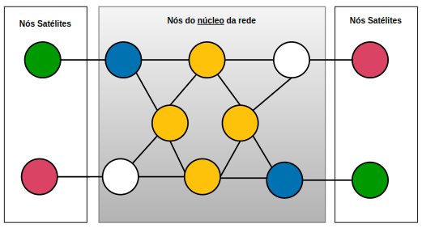
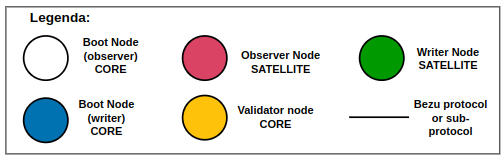

# Rede Blockchain Brasil

Bem vindo à Rede Blockchain Brasil!

A Rede Blockchain Brasil (RBB) é uma rede de instituições, de abrangência nacional, composta de estrutura de governança e infraestrutura tecnológica, que tem o objetivo de facilitar a adoção da tecnologia de blockchain para a implementação de aplicações de interesse público. A criação da rede permitirá a otimização de recursos, redução de custos e remoção de barreiras de entrada para uso da tecnologia e a inovação no setor público.

A RBB foi fundada pelo **Banco Nacional de Desenvolvimento Econômico e Social** (BNDES) e o **Tribunal de Contas da União** (TCU), através de um [Acordo de Cooperação](https://github.com/RBBNet/rbb/blob/master/documentos/ACT%20-%20Documento%20firmado%20entre%20BNDES%20e%20TCU.pdf), [assinado em 12/04/2022](https://www.in.gov.br/web/dou/-/extrato-do-acordo-de-cooperacao-n-d-121.2.0014.22-393697725). Instituições que desejarem participar da rede deverão [submeter sua solicitação](roteiro_adesao.md) à **Governança da RBB**.

## Histórico

A ideia de criar a Rede Blockchain Brasil nasceu no workshop que precedeu a [segunda edição](https://www.bndes.gov.br/wps/portal/site/home/conhecimento/seminarios/II-forum-blockchaingov) do [Fórum BlockchainGov](https://itsrio.org/pt/projetos/blockchaingov/), realizado nas dependências do BNDES em 2019. Organizado em parceria pelo BNDES e pelo [Instituto de Tecnologia e Sociedade (ITS)](https://itsrio.org/), o workshop gerou uma discussão relevante entre instituições públicas com experiência em uso prático da tecnologia.

A percepção geral era que havia uma duplicação de esforços no uso da tecnologia pelo governo. Em geral, para cada caso de uso, a organização interessada precisava superar diversas barreiras legais, organizacionais e técnicas. Embora faça sentido em alguns casos, a necessidade de resolver os mesmos problemas a cada aplicação acaba inibindo a inovação. Adicionalmente, a existência de várias redes inibe a possibilidade de integração entre diversas iniciativas, além de reuso de soluções entre diferentes organizações.

## Modelo

Experiências internacionais como a [LACChain](https://www.lacchain.net) - rede para a América Latina liderada pelo BID, [Alastria](https://alastria.io/) e [EBSI (European Blockchain Service Infrastructure)](https://ec.europa.eu/digital-building-blocks/wikis/display/EBSI/Home) inspiraram a RBB a buscar o caminho de ser uma rede público-permissionada: "pública" porque poderá ser acessada por qualquer pessoa; "permissionada" porque os nós participantes do consenso precisam de permissão para participar. As redes público-permissionadas são uma solução adequada para aplicações de interesse público.

Blockchains públicas são potencialmente muito interessantes para implantações focadas em transparência e confiança. Tal percepção é corroborada pelo [Acórdão 1613/2020 do TCU](https://pesquisa.apps.tcu.gov.br/#/redireciona/acordao-completo/%22ACORDAO-COMPLETO-2406748%22) que aponta como um dos seus maiores potenciais da tecnologia a implantação de medidas anticorrupção e pró-transparência. A possibilidade de implementar processos transparentes e que obedeçam ao princípio de _compliance by design_ é uma grande oportunidade para organizações públicas. Porém, o uso de redes que melhor suportam estas características por instituições públicas apresenta barreiras de diversas naturezas, como por exemplo a aquisição de criptomoedas para remuneração do processamento na rede.

Nas blockchains permissionadas, em geral privadas, os nós que realizam a validação das transações são conhecidos e previamente autorizados, de acordo com os requisitos e propósitos da rede, permitindo a determinação de responsabilidades e tratando a realização do processamento na rede como um compromisso de seus participantes. Porém, tais blockchains não permitem o acesso às informações pelo público em geral.

Já nas blockchains público-permissionadas, é possível buscar um melhor modelo para aplicações de interesse público: a entrega de soluções de transparência e confiança através de redes públicas; e o menor custo e menor desafio tecnológico e regulatório das redes permissionadas.

## Formas de Participação

As instituições participantes da RBB, aderentes ao Acordo de Cooperação, podem ser classificadas como:

- Partícipes Aderentes **Parceiros**
  - Devem promover o uso da RBB em aplicações do serviço público e de interesse público e seguir as decisões sobre a RBB proferidas pela Governança da RBB;
  - Têm direito de executar nós que enviem transações para a rede e tenham acesso a toda a cadeia de blocos;
  - Têm direito a apresentar propostas e participar das reuniões de governança.

- Partícipes Aderentes **Associados**
  - Têm os mesmos direitos e deveres dos partícipes aderentes parceiros;
  - Têm o compromisso de executar nós que possam participar do consenso da rede;
  - Têm direito a votar nas propostas apresentadas.

- Partícipes **Patronos**
  - Apenas BNDES e TCU são considerados partícipes patronos;
  - Têm os mesmos direitos e deveres dos partícipes aderentes associados;
  - Têm direito a voto de desempate e vetar as propostas apresentadas.

Para acesso e operação da rede, as instituições participantes devem seguir o [roteiro técnico] (Roteiro_para_a_criacao_de_uma_rede.md) para instalação e configuração de seus nós.

## Acesso aos Dados pelo Público

Os dados da RBB estão disponíveis para consulta pelo público em geral, conforme seu [modelo](#modelo) de blockchain público-permissionada. Isso significa que qualquer cidadão pode fazer uso de ferramentas para baixar, consultar, tratar e auditar os dados e código (*smart contracts*) gravados na blockchain.

A RBB fornece um [roteiro básico](roteiro_acesso_leitura.md) para quem quiser ligar um nó de leitura (*"observer node"*) e uma ferramenta de visualização de blocos (*"block explorer"*) em seu próprio computador.

Quem quiser subir um nó por conta própria e se conectar, deve usar os seguintes enodes para *discovery*:
```
enode://3fc63306a2df0b19196395dcb117af3b52f4d9b5533f8f77772baf9cab0e7f8a06e8b8191bc5ff15408dda0955ad1556359e67f04a63ff27d7fa5e60aa805815@rbb-observer-boot01.bndes.gov.br:60002
enode://5dd979ae40077dcd3ca620baeeb2328bde18b3a802e9b515181d5ef7c14b3692fc3a00d4d84ae17819d443f4fcfa13e07aa070c53aa191e7f2e46c587dc449a8@10.233.40.40:30303
enode://bf8d93733d707b30f1e09545d0ee3e57cddc697d0fdc9940540d5c4f77ec33bb8ea1cb1eeae8fccddc5b9539147dfa7ff24eb7bd82932243a77b31f83a8a7b0f@139.82.24.160:30303
```

Caso o nó seja uma instância Besu, é possível utilizar como referência [este aquivo *genesis*](artefatos/observer/genesis.json), tomando-se o cuidado de utilizar as opções `--Xdns-enabled=true` e `--Xdns-update-enabled=true` para resolução correta de nomes.

A RBB também oferece um [roteiro](roteiro_criacao_rede_teste.md) para instalação e configuração de uma rede de testes local, em seu próprio computador, para aprendizado e realização de testes.

## Projeto

A implantação da RBB está sendo feita de forma gradativa, conforme determinado em seu Plano de Trabalho, que tem previstas as seguintes atividades:

- Implantação da rede laboratório
- Elaboração do regulamento da RBB
- Estruturação do piloto
- Operação assistida do piloto
- Estruturação da produção
- Promoção do uso da rede e evoluções

Observação: O piloto é uma rede de produção, com a utilização de dados reais, porém com níveis de serviço reduzidos.

O Plano de Trabalho tem previsão de ser executado em 60 meses a partir da assinatura do [Acordo de Cooperação](https://github.com/RBBNet/rbb/blob/master/documentos/ACT%20-%20Documento%20firmado%20entre%20BNDES%20e%20TCU.pdf) entre BNDES e TCU.

Embora a iniciativa da RBB tenha sido oficialmente criada com a assinatura do Acordo em 12/04/2022, uma rede de laboratório e um grupo de debates já existem desde 2021. Várias [iniciativas e discussões técnicas](iniciativas.md) importantes ocorreram nesse período, antecipando discussões e projetos que deverão ser realizados, agora, dentro da estrutura formal. 

## Governança

Informações sobre a [governança da RBB](governanca/README.md). 

## Tecnologia

A implementação de blockchain utilizada na RBB é a do projeto de código aberto [Hyperledger Besu](https://besu.hyperledger.org), que é baseada na rede [Ethereum](https://ethereum.org).

## Topologia

A RBB se baseou no *framework* da [LACChain](https://www.lacchain.net), para definir seu modelo de topologia, que é composta de:

- Nós Núcleo: Desempenham papel essencial para o correto funcionamento da rede. A rede não funciona sem eles.
  - **Nós Conectores** (*Boot Nodes*): Responsáveis por conectar nós validadores a nós satélites.
    - Compartilham o histórico e o estado dos blocos com novos nós.
    - Atualizam nós satélites sobre a geração de novos blocos gerados pelos nós validadores.
    - Repassam transações enviadas pelos nós registradores aos nós validadores.
    - Conectam-se com os nós validadores e nós registradores designados.
  - **Nós Validadores** (*Validator Nodes*): Validam as transações submetidas à rede.
    - Participam do protocolo de consenso e são responsáveis pela geração de novos blocos.
    - Conectam-se entre si e com os nós conectores.
- Nós Satélites: Não desempenham papel essencial no correto funcionamento da rede. Podem se conectar e desconectar da rede sem que isso prejudique o funcionamento da mesma.
  - **Nós Registradores** (*Writer Nodes*): Podem submeter transações para a rede.
    - Enviam transações aos nós conectores, que por sua vez as repassam aos nós validadores.
    - Conectam-se com nós conectores designados.
  - **Nós Observadores** (*Observer Nodes*): Só podem ler as informações registradas na rede.
    - Podem conectar-se apenas com nós conectores que estiverem abertos para permitir a leitura de blocos.
      - Observação: Atualmente a RBB ainda **não** suporta nós conectores com essa possibilidade.






## Incidentes

Para a indicação de gestores de incidentes de sua instituição participante, preencha o documento [Gestor de incidentes](https://github.com/RBBNet/rbb/blob/master/documentos/Modelo%20-%20Carta%20Gestor%20de%20Incidentes.docx) e envie para o e-mail [rbb@bndes.gov.br](#).

## Aviso Legal sobre a participação do Tribunal de Contas da União – TCU

O Tribunal de Contas da União - TCU, órgão de controle externo do governo federal, auxilia o Congresso Nacional na missão de acompanhar a execução orçamentária e financeira do país e contribuir com o aperfeiçoamento da Administração Pública em benefício da sociedade. Para isso, tem como visão ser referência na promoção de uma Administração Pública efetiva, ética, ágil e responsável.

No âmbito da Rede Blockchain Brasil (RBB), o TCU exerce o papel de partícipe fundador, conforme Acordo de Cooperação número D-121.2.0014.22, celebrado em abril de 2022 junto ao BNDES – Banco Nacional de Desenvolvimento Econômico e Social. O acordo estabelece as prerrogativas de cada tipo de partícipe (partícipes fundadores e partícipes aderentes), suas funções, atribuições e poderes. 

Vale destacar, entretanto, que **o TCU, por meio de seus representantes formalmente indicados**, assim como ocorre em outras iniciativas similares, **exerce na RBB papel meramente administrativo, sem qualquer vínculo com as atividades de Controle Externo** advindas de sua função constitucional. A despeito de ser fundador, o TCU atua na Rede como qualquer outro partícipe, resguardadas as funções e poderes de partícipe fundador, descritas no supracitado acordo de cooperação. Portanto, **o TCU, nessa condição, não chancela, corrobora, atesta a validade ou emite opinião prévia sobre as atividades exercidas por partícipes da RBB que porventura sejam passíveis das ações de Controle Externo**. 

## Versionamento

A RBB utiliza regras de [versionamento semântico](versionamento.md) para seu código.

## Contato

Em caso de dúvidas e sugestões, entre em contato através do e-mail [rbb@bndes.gov.br](#).
