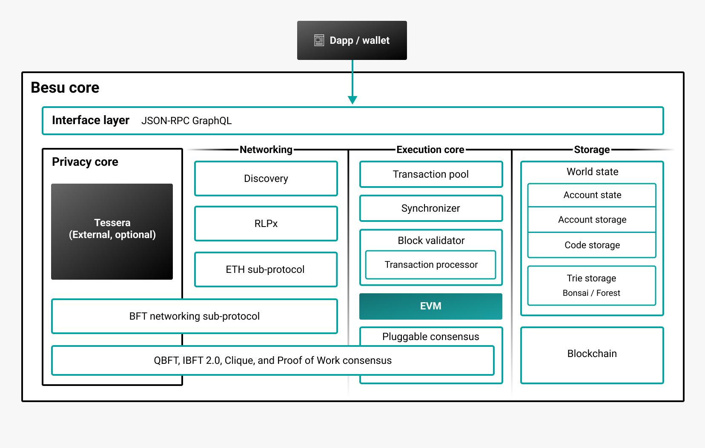
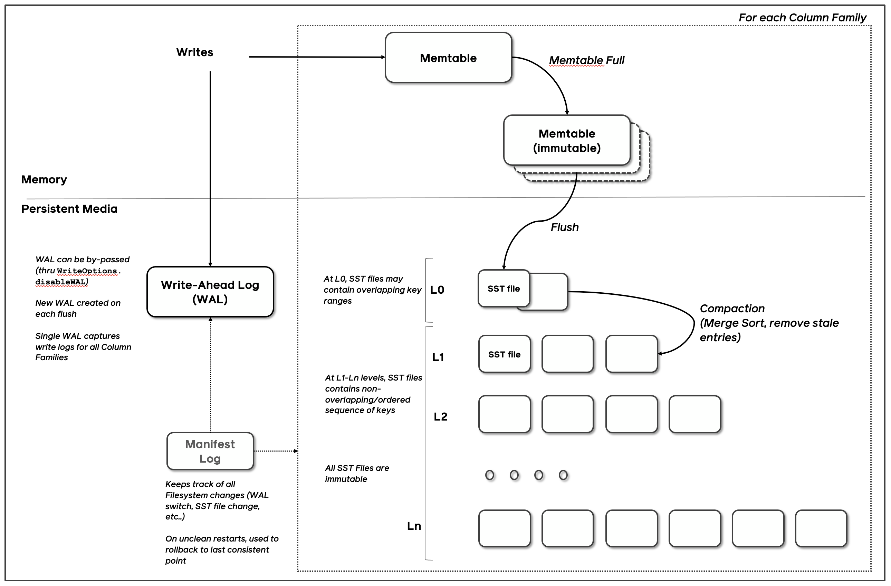
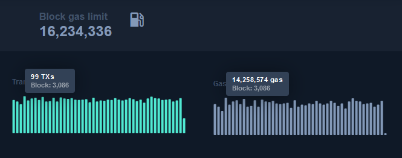
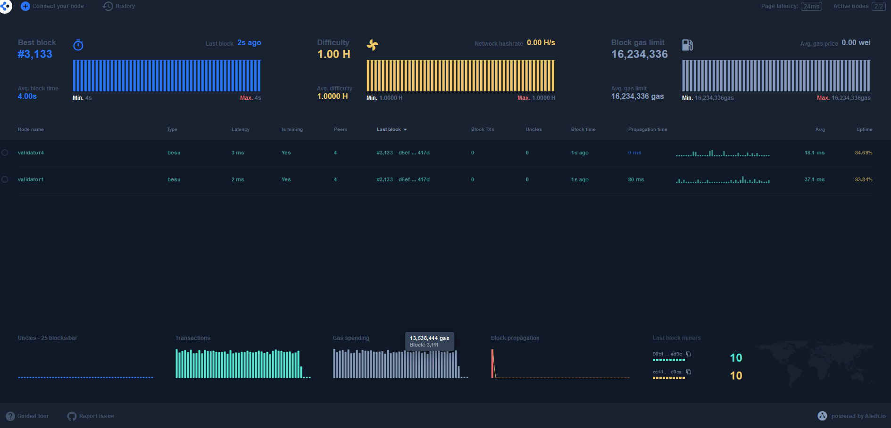

# Projeção de ocupação de espaço de armazenamento

Em uma rede distribuida composta pelos nós de diversas instituições participantes a estimativa da velocidade de crescimento dos dados e da ocupação de espaço de armazenamento em cada nó se torna um desafio devido ao fato de que cada instituição pode disponibilizar e executar suas próprias aplicações, com requisitos de recursos distintos e com casos de uso que ainda não são totalmente conhecidos.


O intuito desse trabalho não é realizar tal estimativa com exatidão, mas sim um levantamento baseado em experimentos que nos permitam obter valores e estimativas em ambientes reais e com um volume de transações próximo ao que observamos como viável na rede laboratório da RBB.


## Hyperledger Besu

O Hyperledger Besu em sua versão atual utiliza o banco de dados de chave-valor [RocksDB](https://github.com/facebook/rocksdb) para persistir os dados da cadeia localmente. Esses dados são divididos em algumas subcategorias:
* **Blockchain**: os dados são compostos de cabeçalhos de bloco que formam a “cadeia” de dados usada para verificar criptograficamente o estado do blockchain; corpos de bloco que contêm a lista de transações ordenadas incluídas em cada bloco; e recibos de transações que contêm metadados relacionados à execução de transações, incluindo logs de transações.
* **World State**: cada cabeçalho de bloco faz referência a um *World State* por meio de um hash stateRoot. O *World State* é um mapeamento de endereços para contas. As contas de propriedade externa contêm um saldo de ether, enquanto as contas de contrato inteligente contêm adicionalmente código executável e armazenamento.



### RocksDB

As três construções básicas do RocksDB são memtable, sstfile e logfile. 

A memtable é uma estrutura de dados na memória. Novas gravações são inseridas na memtable e opcionalmente gravadas no arquivo de log (também conhecido como Write Ahead Log (WAL)). O arquivo de log é um arquivo gravado sequencialmente no armazenamento. Quando a memtable fica cheia, ela é descarregada para um arquivo no formato **sst** no armazenamento e o arquivo de log correspondente pode ser excluído com segurança. Os dados em um arquivo sst são classificados para facilitar a pesquisa de chaves.



[fonte: github.com/facebook/rocksdb](https://github.com/facebook/rocksdb/wiki/RocksDB-Overview#3-high-level-architecture)

Como exemplificação, na configuração do HL Besu na rede Lab observamos essa estrutura de arquivos no diretório "database"

```bash
validator
        ├── besu.networks
        ├── besu.ports
        ├── caches
        │   ├── CACHE_METADATA.json
        │   ├── logBloom-0.cache
        │   ├── logBloom-1.cache
        │   └── logBloom-2.cache
        ├── database
        │   ├── 000160.sst
        │   ├── 000184.sst
        │   ├── 000215.sst
        │   ├── 000253.sst
        │   ├── 000259.sst
        │   ├── 000285.log
        │   ├── 000286.sst
        │   ├── CURRENT
        │   ├── IDENTITY
        │   ├── LOCK
        │   ├── LOG
        │   ├── MANIFEST-000255
        │   ├── OPTIONS-000282
        │   └── OPTIONS-000284
        ├── DATABASE_METADATA.json
        ├── genesis.json
        ├── key
        ├── logs
        ├── log.xml
        ├── static-nodes.json
        └── uploads

```


## Experimentos realizados

No modelo blockchain adotado na RBB os blocos são gerados em um tempo pré determinado, atualmente 4 segundos, havendo sempre a geração de blocos mesmo que não sejam enviadas transações para a rede. Isso faz com que a rede se torne mais resistente a ataques pois mesmo que haja um período sem novas transações, os validadores estão sempre gerando blocos os quais são expostos ao consenso e verificação pelos demais nós da rede. 

Nos experimentos realizados foram levados em consideração apenas o espaço utilizado no escopo do armazenamento no banco de dados RocksDB que é o local onde temos o crescimento mais significativo e persistente, pois os demais diretórios, como por exemplo o de logs, podem sofrer configurações diferenciadas e regras de expurgo de acordo com o padrão de retenção de cada instituição. 

A estrutura de testes foi composta por uma rede privada executando o algoritmo de consenso Proof of Authority (PoA) [QBFT](https://besu.hyperledger.org/private-networks/how-to/configure/consensus/qbft) em 4 nós validadores e mais 1 nó para interação e envio de transações (writer). Para os casos que envolveram envio de transação também foi utilizada mais uma máquina rodando a aplicação cliente em docker.

### 01 - Utilização de armazenamento por blocos vazios (zero transações)

O intuito desse experimento foi aferir de forma prática o crescimento do espaço de armazenamento utilizado por **blocos que não possuem transações**.


Foram gerados 102.692 blocos no periodo de avaliação de ~114 horas e obtivemos o consumo de ~139MB de espaço utilizado.

Tais dados nos permitem fazer a seguinte projeção de consumo por blocos vazios


|Periodo|Consumo|
|--|--|
|Diário| 29,26 MB|
|Mensal| 877,89 MB|
|Anual| 10,53 GB|

### 02 - Utilização intensiva da rede de testes

O intuito desse experimento foi simular a utilização intensiva da rede e aferir de forma prática o crescimento do espaço de armazenamento utilizado por **blocos com alto percentual de preenchimento**.


Nesse teste o parâmetro *Block Gas Limit* da rede estava definido em 16.234.336 o que permitiu estabilidade nos testes com a manutenção de alto preencimento dos blocos sem exceder o tempo de 4 segundos na geração destes.

Para gerar a massa de testes foi utilizada a aplicação [Ethereum-Benchmark](https://github.com/lacchain/Ethereum-Benchmark) configurada para enviar transações com um payload de 10KB durante 5 horas a taxa de 28 transações por segundo. Isso permitiu que tivéssemos a ocupação dos blocos aproximando-se de 80% de forma constante e sustentável para esse ambiente.



```bash
# Ethereum-Benchmark

server1_1  | ************STIMULUS STATISTICS***************
server1_1  | N° sent Tx:  504000
server1_1  | time (s): 22346.514
server1_1  | Rate:  22.55385336612234 tx/s
server1_1  | Data on each Tx (KB):  10
server1_1  |
server1_1  | ************RESPONSE STATISTICS***************
server1_1  | N° processed Tx by Pantheon:  503914
server1_1  | N° no processed txs: 86
server1_1  | response time (s):  22349.737
server1_1  | Effectiveness(%): 99.9829365079365%
server1_1  | Average responsiveness rate:  22.550600931008717 tx/s
server1_1  | All done!!
ethereum-benchmark_server1_1 exited with code 0
```





Foram enviadas 504000 transações com 10KB de conteúdo o que totalizou ~5,04GB em dados enviados nas transações.

O teste durou no total ~6:10h e utilizou 5510 blocos.

Após a reinicialização do HL Besu, analisamos a utilização de disco e total ocupado no diretório *database* foi de 5.1 GB. Considerando-se apenas os arquivos .sst foi de 4.2GB. Após 3 dias em funcionamento sem enviarmos novas transações verificamos novamente o estado do ambiente e o espaço total ocupado no diretório foi de 4.4 GB. Considerando-se apenas os arquivos .sst foi de 4.3 GB


Para essa rede de testes em uso intensivo, os experimentos nos permitiram fazer a seguinte projeção

|Periodo|Consumo|
|--|--|
|Diário| 16,8 GB|
|Mensal| 504 GB|
|Anual| 6.05 TB|

        Lembramos que os experimentos foram realizados em uma rede de teste criada para esse fim, a qual não é a rede lab oficial da RBB e os resultados aqui observados devem ser vistos apenas como referência para novos experimentos e projeções de uso.